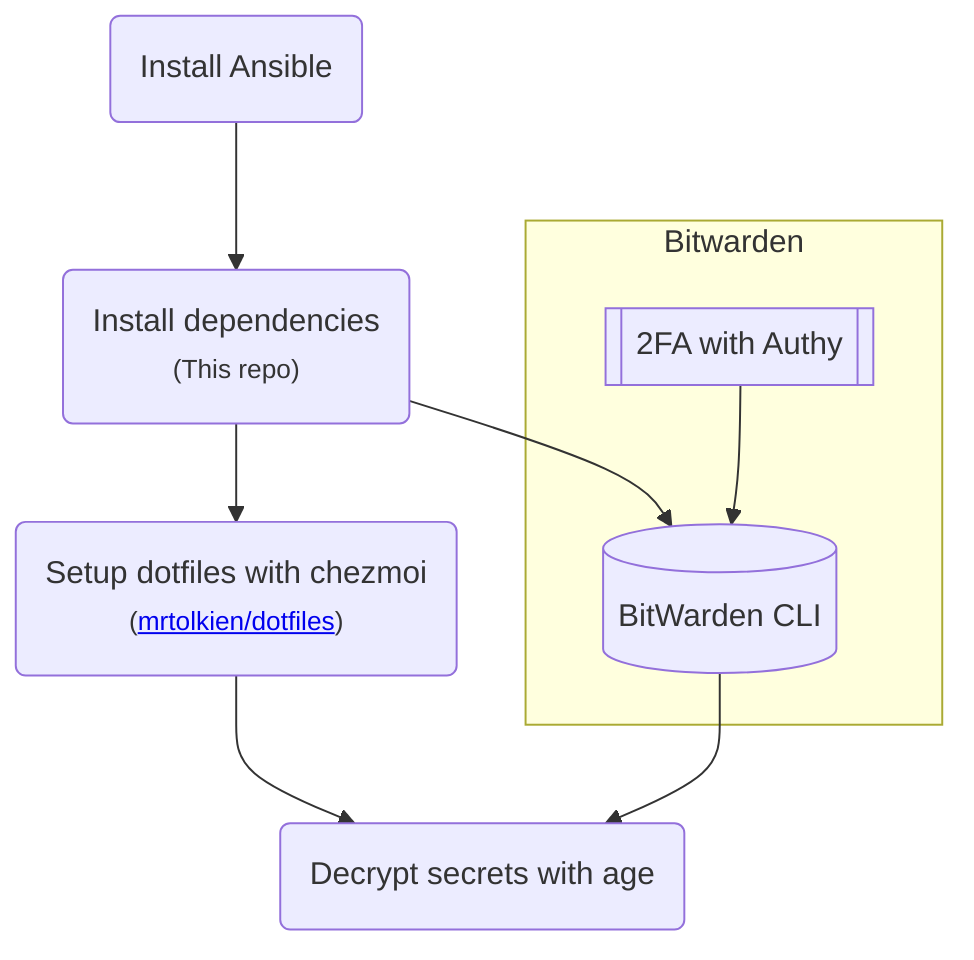

# TolkOS - Ansible playbooks for my machines

## TL;DR

```sh
ansible-pull -U https://github.com/mrtolkien/tolkos.git local.yml && sh -c "$(curl -fsLS get.chezmoi.io)" -- init --apply mrtolkien
```

## Flow



## Installed

This repo uses `Ansible` to install:

- `zsh`
- `starship`
- `nvim`
- `exa`
- `bat`
- `zoxide`
- `atuin`
- `ripgrep`
- `age`

They are then configured with my [dotfiles repository](https://github.com/mrtolkien/dotfiles) which uses an interactive setup.

## Pre-requisites

- `git`
- `ansible`

```shell
python3 -m pip install --user ansible
```

## Linux setup

### Testing with Docker

Build and start the image:

```sh
docker build . -t ansible_test --platform linux/amd64 && docker run --rm -it --platform linux/amd64 ansible_test
```

Load dotfiles interactively with chezmoi:

```sh
sh -c "$(curl -fsLS get.chezmoi.io)" -- init --apply mrtolkien && source ~/.zshrc
```

## Python

TODO Review, this is obsolete

```shell
ansible-galaxy install -r requirements.yaml
ansible-playbook -K python.yaml
```

The python playbook installs:

- [`pyenv`](https://github.com/pyenv/pyenv)
- [`python`](https://en.wikipedia.org/wiki/Python_(programming_language))
- [`pipx`](https://github.com/pypa/pipx)
- [`poetry`](https://python-poetry.org/)
