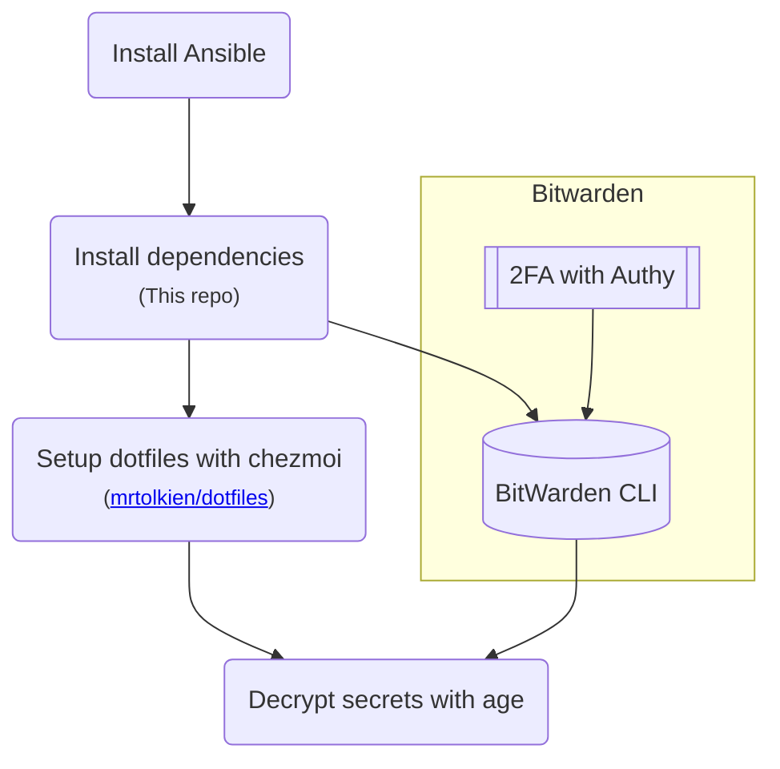

# TolkOS - Ansible playbooks for my machines

## TL;DR

Install dependencies

```sh
ansible-pull -U https://github.com/mrtolkien/tolkos.git local.yml
```

Login to Bitwarden

```sh
bw login
```

Setup dotfiles

```sh
sh -c "$(curl -fsLS get.chezmoi.io)" -- init --apply mrtolkien
```

## Flow



## Installed

This repo uses `Ansible` to install:

- `zsh`
- `starship`
- `nvim`
- `exa`
- `bat`
- `zoxide`
- `atuin`
- `ripgrep`
- `age`

They are then configured with my [dotfiles repository](https://github.com/mrtolkien/dotfiles) which uses an interactive setup.

## Pre-requisites

- `git`
- `ansible`

```shell
python3 -m pip install --user ansible
```

## Linux setup

### Testing with Docker

Build and start the image:

```sh
docker build . -t ansible_test --platform linux/amd64 && docker run --rm -it --platform linux/amd64 ansible_test
```

Load dotfiles interactively with chezmoi:

```sh
sh -c "$(curl -fsLS get.chezmoi.io)" -- init --apply mrtolkien && source ~/.zshrc
```

## TODO

- [] Try using `brew` for more things even though it doesn't work on Linux AMD64
- [] Test playbook on Ubuntu 20
  - [] `exa` and `helix` install need to be made into distro-specific things
- [] Test playbook on Fedora
  - [] `helix` needs a few additional things
- [] Reliably test playbook on Mac OS
- [] Add `fd` to install
